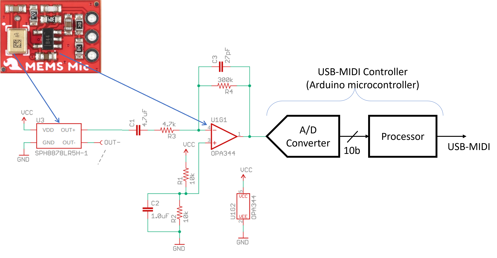
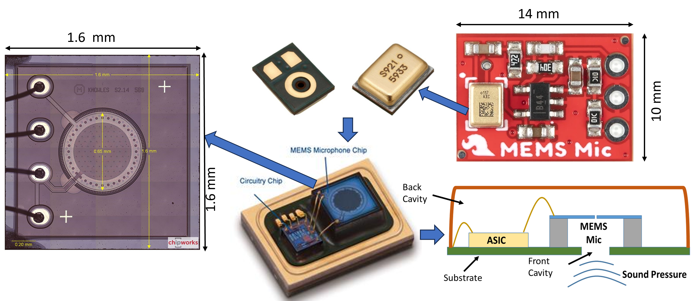

# USB Microphone System

**RESOURCES**

- [SparkFun Analog MEMS Microphone Breakout - SPH8878LR5H-1](https://www.sparkfun.com/sparkfun-analog-mems-microphone-breakout-sph8878lr5h-1.html)
- [Datasheet: MEMS Microphone](https://cdn.sparkfun.com/assets/0/5/8/b/1/SPH8878LR5H-1_Lovato_DS.pdf)
- [Datasheet: OPA344](https://www.ti.com/lit/ds/symlink/opa345.pdf?ts=1748277734116&ref_url=https%253A%252F%252Fwww.google.com%252F)
- [Schematic: Sparkfun breakout board](https://cdn.sparkfun.com/assets/7/5/6/e/d/SparkFun_Analog_MEMS_Microphone_Breakout_SPH8878LR5H-1.pdf)

# MEMS Microphone Teardown

